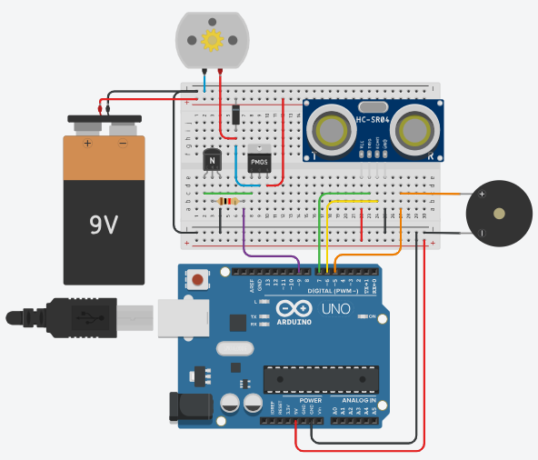

# 🚗 Automatic Emergency Braking (AEB) Simulation in Tinkercad

This project simulates a basic **Automatic Emergency Braking (AEB)** system using **Tinkercad**, demonstrating how an ultrasonic sensor can detect obstacles and automatically stop a vehicle (DC motor) to prevent collision. It's a simple representation of real-world AEB systems used in modern electric and autonomous vehicles.

## 🧰 Components Used

- Arduino Uno
- Ultrasonic Sensor (HC-SR04)
- DC Motor
- Buzzer
- L293D Motor Driver (or simulated transistor setup)
- Breadboard and connecting wires

## 💡 Concept

The ultrasonic sensor continuously measures the distance to the nearest object. When the distance falls below a defined safety threshold (e.g., 20 cm), the Arduino triggers:

- **DC Motor stop** — simulating the vehicle braking.
- **Buzzer ON** — as a warning signal to the driver.

This emulates a basic version of how real vehicles automatically brake when they detect a potential collision.

## ▶️ Try It Yourself

You can interact with the project and run the simulation on Tinkercad:

👉 **[Open AEB Simulation in Tinkercad](https://www.tinkercad.com/things/6O6iI0jD2JG-aeb)**  

## 🖼️ Circuit Diagram

## 📚 Applications

This project is a simplified educational demo of:
- Automatic Emergency Braking systems
- Sensor-based obstacle detection
- Real-time motor control with microcontrollers

---
